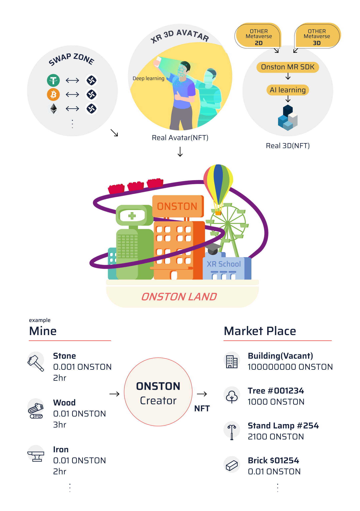

# Metaverse Ecosystem

> ## ECO SYSTEM

There are Mining Zones in ONSTON.

&#x20;Materials (stone, tree, metal ... etc.) needed for different production can be obtained from Mining.  &#x20;

Each material is graded, and rare materials can be acquired by certain probability.

Rare materials are also produced by combining lower grade materials.

The collected materials also be sold on ONSTON shops so that users can enjoy economic activities.    &#x20;

Those collected materials can produce random boxes and upgraded to material of higher grade. Rare materials can be obtained in low probability.

*
[x]   * Individual users can unearth materials to make NFTs from mining zones, and if in possession of many ONSTONs, they can either buy materials or sell the materials on ONSTON Market place to accumulate ONSTON currencies.
